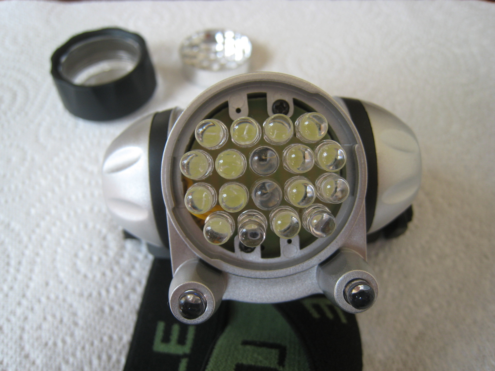
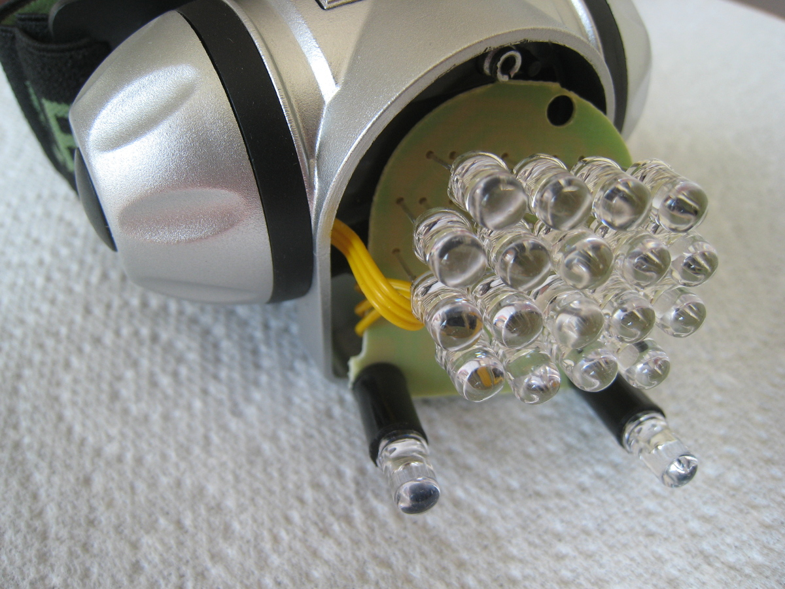

Title: A modest mouse: Building a low-cost, head-mounted infrared pointing device
Category: blog
Tags: accessibility, hci, opencv, python
Slug: a-modest-mouse
Date: 2018-05-30

I stopped using a mouse a few years ago and replaced it with a small USB touchpad. Still, I've always had an eye on getting rid of hand-based pointing devices completely. A few months back, I saw [an article on Ars Technica](https://arstechnica.com/gaming/2018/02/coding-without-a-keystroke-the-hands-free-creation-of-a-full-video-game) about a coder who programmed a game entirely without using his hands. He primarily used speech recognition, but for a mouse replacement, he used a [SmartNav 4](https://www.naturalpoint.com/smartnav/products/4-at).

The SmartNav 4 uses an infrared (IR) transmitter, reflector, and sensor to track a user's head movements and move the mouse pointer accordingly. Essentially a combined transmitter/receiver unit sits by the monitor. It sends out an IR beam that is sent back to the sensor by a special reflective sticker affixed to the user's head (either directly, or on a hat).

Unfortunately, the SmartNav costs $500 US -- not exactly an inexpensive piece of hardware! And SmartNav is one of the 'cheaper' options; you can easily pay $1500 US for similar products.

It got me thinking about building a head-based IR pointing device on the cheap. I considered a design similar to the SmartNav, but I wasn't excited about shining IR LEDs into my eyes for long periods of time. Supposedly the SmartNav has filters to handle this, but I didn't want to take the risk with my own setup. So instead of the transmitter beaming IR towards the head (as the SmartNav does), my head would be the 'platform' for the IR transmitter, and the computer would be the IR receiver.

## Hardware

First I needed something that could detect IR on the computer's side. I had a cheap webcam lying around:

<figure>

</figure>

I did the tried-and-true test of pressing a button on a TV remote and looking at the resultant image captured by the webcam:

<figure>

</figure>

No problem there: the camera could 'see' in infrared. In fact every webcam I tested (four in total) detected IR. 

Next up was the IR transmitter. It needed to be head-mounted, and comfortable. A modifiable headlamp seemed the way to go. As a proof-of-concept first though, I put together a dead-simple, battery-powered IR LED 'transmitter' on a breadboard:

<figure>

</figure>

The webcam detected it easily, and basic software tracking using [OpenCV](https://www.opencv.org) looked promising (more on this below). Stray IR and light from windows, overhead lighting, and other sources was a problem though. I needed a pass filter for IR wavelengths that I could put over the webcam lens, and [this 808nm-1064nm wavelength IR pass filter](https://www.aliexpress.com/item/9mm-Filter-Lens-Filtering-against-400nm-750nm-Pass-808nm-1064nm-IR-InfraRed-Laser-Only/32278589551.html) seemed the perfect size at 9mm diameter:

<figure>

</figure>

And here is the filter covering the webcam lens:

<figure>

</figure>

The filter dramatically reduced unwanted light from reaching the camera. I could now reliably detect and track the IR transmitter beam in various conditions: sunlight coming through open curtains, overhead lights on, etc.

It was time to spend some money on a 'real' IR transmitter. I needed a headlamp with LEDs that I could modify, and [this one on Amazon](https://www.amazon.com/Headlamp-Headlight-Battery-Batteries-Included/dp/B005FEGYJC) seemed to fit the bill. 

Disassembling the lamp was easy: twist the lens cap, remove a holding bracket, and unscrew the circuit board containing the LEDs:

<figure>

<figcaption>Headlamp with lens cap removed.</figcaption>
</figure>

<figure>

<figcaption>Headlamp with circuit board removed.</figcaption>
</figure>

<figure>

<figcaption>Headlamp with back side of circuit board exposed.</figcaption>
</figure>

<figure>

<figcaption>Headlamp with side view of circuit board.</figcaption>
</figure>

The lamp has four lighting modes: three levels of white light brightness (2 LEDs, 10 LEDs, and 18 LEDs), and a red light flashing mode. I de-soldered the two LEDs in the center that provide the lowest white light level, and soldered two [890nm IR LEDs](https://uk.rs-online.com/web/p/ir-leds/6997663) in their place. (If you do this yourself, remember that LEDs are diodes, and the positive / negative terminals need to be soldered in the correct orientation. Look at the other LEDs on the board to determine which way they should go.)

I put everything back together and tested the headlamp with the IR webcam receiver. It worked brilliantly (pun intended) -- one push of the power button turned on the IR LEDs, another push enabled medium white light, another push enabled high white light, another push enabled red flashing, and a final push turned the lamp off.

I now had a functioning head-mounted IR transmitter that still worked as a "normal" headlamp if necessary.

### Parts list

* [Headlamp](https://www.amazon.com/Headlamp-Headlight-Battery-Batteries-Included/dp/B005FEGYJC) (here is a [UK variant](https://www.amazon.co.uk/Lighting-EVER-3200001-LED-Headlamp/dp/B005FEGYJC)): $8 US / £6 UK
* [890nm IR LEDs](https://uk.rs-online.com/web/p/ir-leds/6997663): $4.75 US / £3.40 UK for a pack of 10 (though we only need two of them for the headlamp)
* [IR pass filter](https://www.aliexpress.com/item/9mm-Filter-Lens-Filtering-against-400nm-750nm-Pass-808nm-1064nm-IR-InfraRed-Laser-Only/32278589551.html): $4.75 US / £3.40 UK

So for less than $20 US (not counting a soldering iron or webcam) we have all the parts we need to create a head-mounted pointing device and receiver. 

Remember though, like the SmartNav and other related devices, this is solely a **pointing** device: all it does is move the mouse pointer. It doesn't do mouse button clicks. For clicking, you need something else: a speech recognition application, a foot pedal, a USB button... there are many possibilities.

## Software

(To view the code, see the [GitHub repository](https://github.com/ccoff/ir-mouse).)

With the hardware components ready, it was time to turn to the equally important task of writing some code to track the IR beam and move the mouse pointer.

[OpenCV](https://www.opencv.org) is ideally suited to this task; i.e., determining where a particular type of object is located in an image. With built-in routines for webcam image captures and processing, it really takes a lot of the hard work off of your hands, allowing you to concentrate on tracking that IR beam.

For mouse pointer manipulation, I had used [PyUserInput](https://github.com/PyUserInput/PyUserInput) in another project of mine, and it had worked well. PyUserInput is Python-based, and OpenCV has Python bindings available. (I use Debian, and it includes the python-opencv package; your Linux distribution probably does as well. I have not tested this on Windows.)

I had concerns that performance might be unacceptably slow using Python with OpenCV, but they proved to be unfounded. The app hums along with no noticeable lag between head movement and mouse pointer movement.

Again, see [the code](https://github.com/ccoff/ir-mouse) for details as to what is going on under the hood, but in short, it uses value and hue thresholds to filter out everything in the captured image but the IR beam. (The IR pass filter on the webcam makes this process much more reliable by removing stray interference.) If the beam has moved a sufficient distance, we move the mouse pointer as well. The greater the distance the IR pointer moves, the greater the scale factor we use to determine how much the mouse pointer moves.

It took some fiddling to achieve an acceptable acceleration rate for the pointer, as well as handle small, fine movements. If you use this code in your own project, you will likely want to adjust these values (as well as the hue and value thresholds) for your own environment.

## Final thoughts

So now that I have this setup, have I ditched the touchpad? No, not completely. You have to wear a headlamp on your head, which can get cumbersome. A logical next step would be to try and remove the headlamp / IR pass filter from the mix completely, and just detect head or eye movement directly, perhaps by using [OpenCV's CascadeClassifiers](https://docs.opencv.org/2.4/doc/tutorials/objdetect/cascade_classifier/cascade_classifier.html). (Hacking a headlamp is a lot more fun though!)

In any event, I hope this project helps and inspires others who are looking for a low-cost, assistive technology pointing device.

