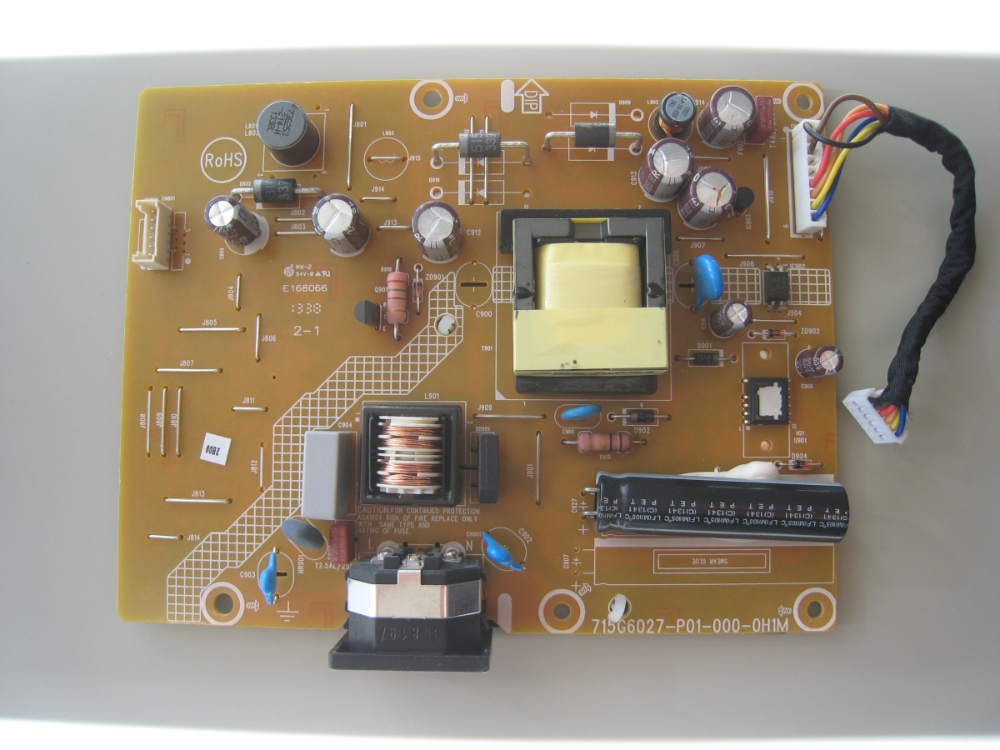
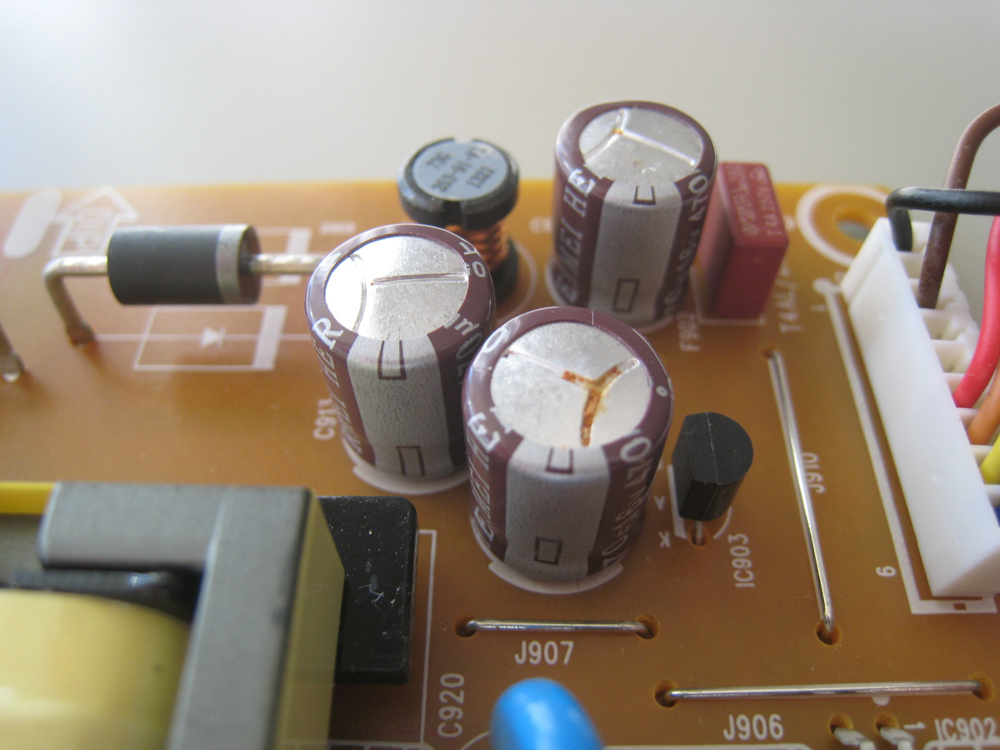
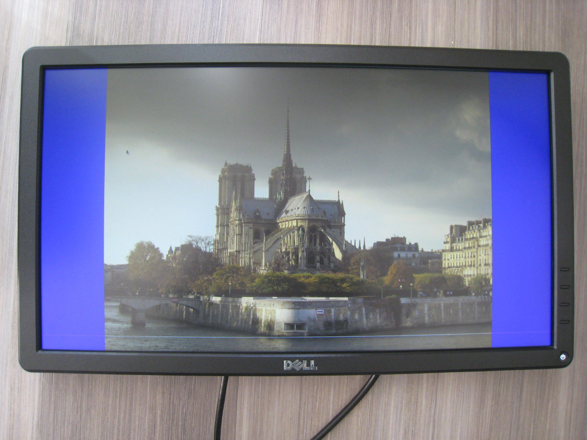

Title: Repairing an LCD monitor
Category: blog
Tags: hardware, repair, monitor
Slug: repairing-lcd-monitor
Date: 2019-12-14

I have an old [Dell E2014H 20" monitor](https://www.dell.com/support/home/us/en/19/product-support/product/dell-e2014h/docs) that recently started having issues: when I turned it on, the power LED blinked on and off over and over, and the screen remained blank. So the monitor was getting power, but something was amiss somewhere.

Web searching indicated that [certain Dell monitors were prone to blown capacitors](https://superuser.com/questions/729741/dell-u2311h-monitor-gone-bad-which-capacitors-do-i-replace), which can lead to the symptoms I was seeing. In some cases, people had been able to replace the capacitors on the power supply board and restore the monitor to normal working order.

I had nothing to lose and figured it was worth a shot. The first step was to disassemble the monitor, which was the hardest part by far of the entire process. Specifically, prying the bezel from the front of the monitor took some doing -- an old London transit card I had laying around proved to be the best tool for this. In any event, after some careful disassembly at last I had unrestricted access to the power supply board:

Sure enough, there were three blown capacitors exhibiting the telltale bulging "dome" top and residue:

I figured I might as well replace all of the power supply capacitors while I had the monitor disassembled. There were four different types of capacitors on the power supply board:

* 470 mF, 16 V (these were the three blown caps)
* 470 mF, 25 V
* 47 mF, 50 V
* 4.7 mF, 100 V

In addition, the capacitors needed to have low [ESR](https://en.wikipedia.org/wiki/Equivalent_series_resistance), high [ripple current](https://en.wikipedia.org/wiki/Ripple_(electrical)), and be rated for high temperature.

I was able to find them all with the exception of the 4.7 mF, 100 V which despite my best efforts I could not locate anywhere. Still, for less than $10 US I had high-quality Panasonic capacitors (from [mouser.com](https://www.mouser.com)) that I could use to replace all of the existing capacitors except one.

I removed the old capacitors and soldered the new ones on the power supply board. I then reassembled the monitor, and the moment of truth arrived. I plugged in the power cord and - boom! - it powered up without a hitch:

So with less than $10 of parts I was able to reclaim a monitor otherwise destined to become e-waste.

