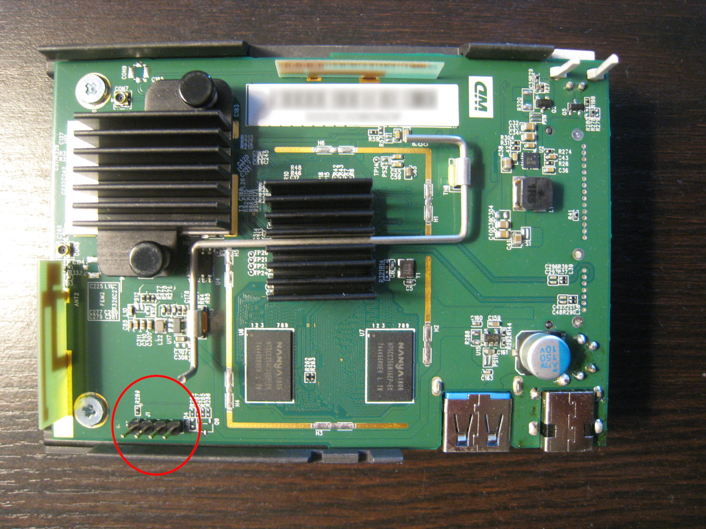
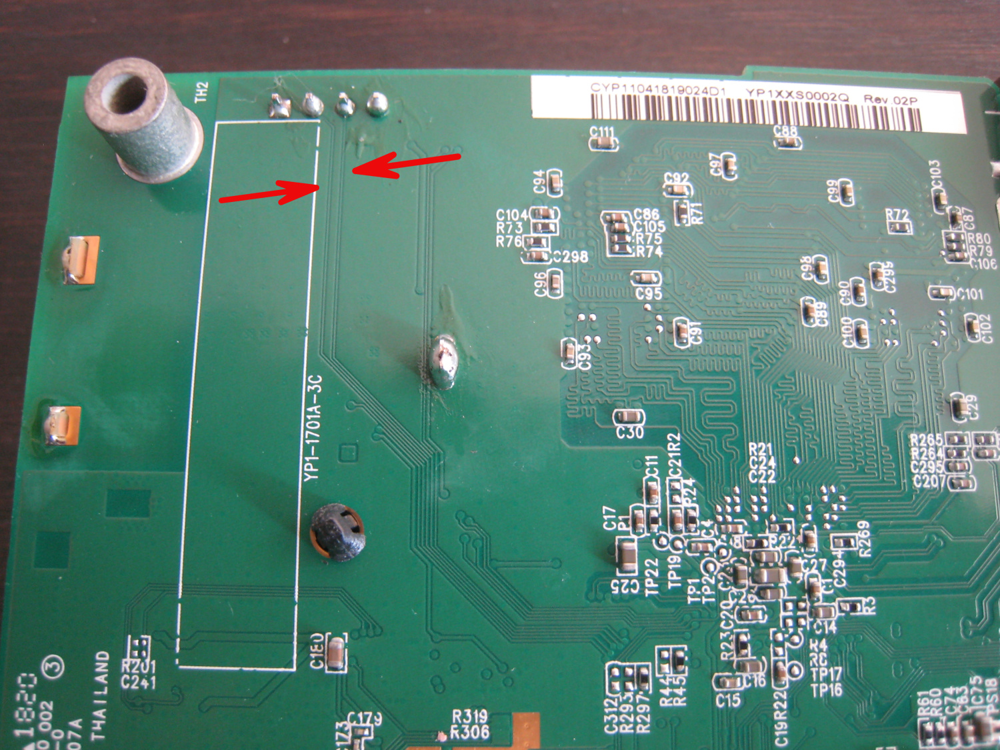
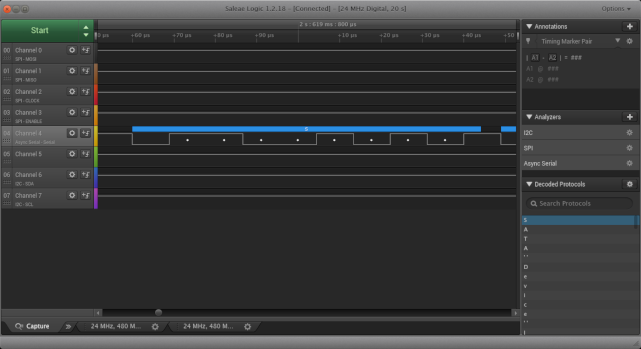

Title: The art of finding a UART
Category: blog
Tags: hardware, reverse engineer, UART
Slug: art-of-finding-uart
Date: 2020-01-21

Recently I had access to an [Ibi](https://www.meetibi.com) to play around with. The Ibi is a networked media storage device from Sandisk, which is now part of Western Digital. Sandisk bills the Ibi as a "personal cloud for your photos and videos." However, you can only use it with their Ibi smartphone app, and that app requires a ridiculous amount of permissions -- you might as well install a backdoor on your phone. I wanted to see what made the Ibi tick, and if it could be customized.

On the outside, the Ibi has a USB 3.0 port, power jack, and LED. There is no ethernet port, only WiFi, and no video output. Beyond that it's a black box (figuratively speaking, as it has a white case). What I needed was a serial [UART](https://en.wikipedia.org/wiki/Universal_asynchronous_receiver-transmitter) (universal asynchronous receiver-transmitter) connection to see device startup messages and information about its configuration. Many routers, switches, and other embedded devices have some sort of UART capability for troubleshooting and diagnostic purposes, and I hoped the Ibi would be the same.

I opened up the case, and the Ibi's innards slid out easily enough. There was a main [PCB](https://en.wikipedia.org/wiki/Printed_circuit_board) with the hard drive underneath:



Of most interest was the 4-pin header at J1 (circled in the image above), which I suspected was a UART. With the Ibi powered off, I used a multimeter to test J1's pins for ground, which turned out to be pin 4. Pins 2 and 3 had thin traces on the back of the PCB running towards the [SoC](https://en.wikipedia.org/wiki/System_on_a_chip) (see arrows in the image below). These were quite likely the transmit (TX) and receive (RX) pins: 



So pin 1 remained as the likely candidate for power (VCC). I powered up the device several times, measuring the voltage on pins 1, 2, and 3. Pins 1 and 3 remained steady at 3.3V, but the voltage on pin 2 fluctuated during startup. This was probably the TX pin shoveling out serial data.

Based on all of this information, at this point I was pretty confident that pin 1 = VCC, pin 2 = TX, pin 3 = RX, and 4 = GND. Before I hooked up my USB-UART adapter though, I used a logic analyzer to confirm my hypothesis. The analyzer's parser showed that there was indeed outgoing data that it could decode on pin 2:



Next, I connected the USB-UART adapter and started *screen* at the standard 115200 baud rate:

```text
screen /dev/ttyUSB0 115200
```

I powered up the board, and was greeted with a stream of text as U-Boot and the kernel did their thing:

```text
[sid]delta long!!11250

[sid]delta long!!11250

C1:80000000
C2
?
C3h
hwsetting size: 000005EC
C4
f 
5-5
Goto FSBL: 0x10100000

[*** Output truncated for brevity ***]

CPU  : Cortex-A53 quad core - AARCH32
Board: Realtek QA Board
DRAM:  1 GiB
Watchdog: Disabled
Cache: Enabled
Non-Cache Region: 1 MB@0x07900000
nor flash id [0x00ef4014]
sector 256k en: 0
sector  64k en: 1
sector  32k en: 1
sector   4k en: 1
page_program  : 1
max capacity  : 0x00100000
spi type name : WINBOND_W25Q80BV_8Mbit
[SATA] enable SATA interface
[SATA] spread-spectrum disable
Factory: NOR
Factory: pp:0, seq#:0x10, size:0x2800

[*** Output truncated for brevity ***]

[    0.000000] Booting Linux on physical CPU 0x0
[    0.000000] Initializing cgroup subsys cpuset
[    0.000000] Initializing cgroup subsys cpu
[    0.000000] Initializing cgroup subsys cpuacct
[    0.000000] Linux version 4.1.17 (build@build-yocto2) (gcc version 4.9.4 20150629 (prerelease) (Realtek ASDK64-4.9.4p1 Build 2285) ) #1 SMP PREEMPT Wed Jul 24 17:13:01 PDT 2019 (commit id:a61c128eddbd2d423fca8adfe4ee1c2aaa8ee6df)
[    0.000000] CPU: AArch64 Processor [410fd034] revision 4
```

After startup completed, I arrived at a shell prompt as the root user:

```text
root@yodaplus32_mini:/ #
```

So the UART gave me what I needed -- visibility into the startup process, and a shell for looking around the filesystem. It turns out the Ibi uses a two-stage U-Boot loading process and runs Android. There is no SSH server (or even a text editor) installed, so it's a pretty bare-bones OS installation.

The bootup process indicates the CPU is a quad-core A53 ARM processor; looking at the board under the heatsink reveals a [Realtek RTD1295 SoC](https://www.realtek.com/en/products/communications-network-ics/item/rtd1295). Unfortunately, Linux kernel support for the Realtek RTD1295 is patchy, though work appears to be picking up in that area. Hopefully in the near future, it will be possible to boot a vanilla kernel on the Ibi and get a full Linux distro running on it, as opposed to a locked-down Android install.

