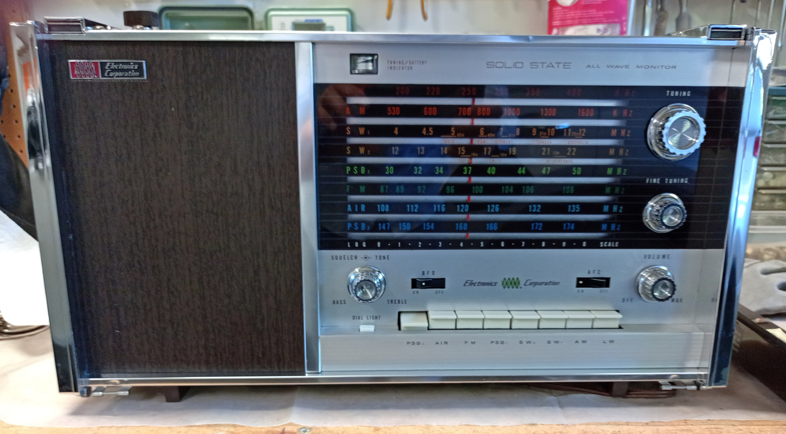
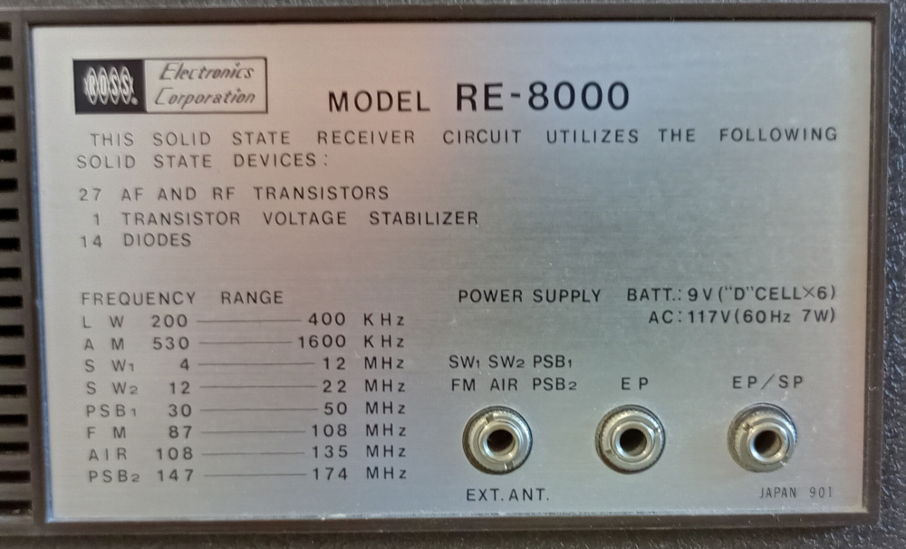
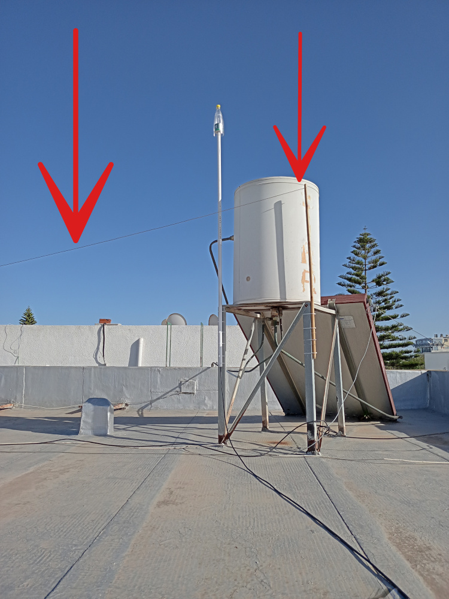
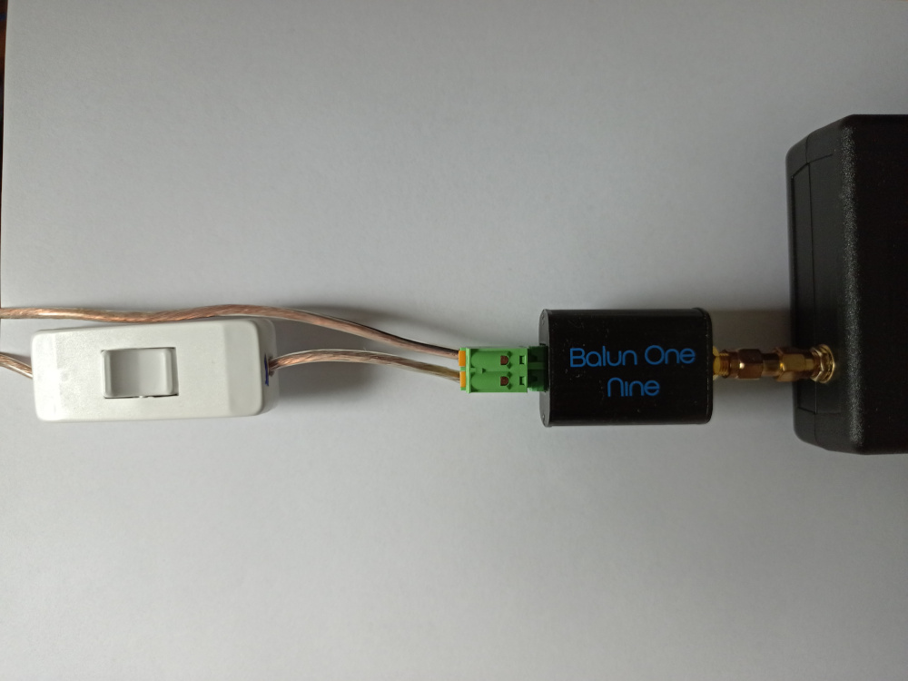

Title: Not your father's radio: listening to shortwave with software-defined radio
Category: blog
Tags: radio, sdr, shortwave
Slug: listening-to-shortwave-with-sdr
Date: 2022-10-04

Many years ago, I used my father's radio every now and then to listen to the shortwave bands. I would slowly turn the dials, hunting around for something to listen to. When I landed on something audible and semi-intelligible, I'd try to figure out what language I was hearing and where the transmission might be coming from.

The radio was a big, analog set -- specifically, an ["RE-8000"](https://www.radiomuseum.org/r/ross_world_master_re_8000.html) made by [Ross Electronics Company](https://www.radiomuseum.org/dsp_hersteller_detail.cfm?company_id=3298):

<figure>

<figcaption>All those dials and pushbuttons... This radio still works, by the way.</figcaption>
</figure>

<figure>

<figcaption>Backplate with frequency ranges.</figcaption>
</figure>

<!--
https://radioattic.com/item.htm?radio=0270328
-->

Looking back, there's a certain nostalgic appeal to twisting the dials and slowly working my way across the bands. But technology moves on, and there are more efficient (and I would argue, enjoyable) ways now to pull those faraway transmissions out of the air -- namely, SDR (software-defined radio).

## The receiver
Software-defined radio opens up a world of possibilities. As I've mentioned in other posts, I have received [satellite](https://ccoff.github.io/chasing-weather-satellites-with-sdr) and [aircraft](https://en.wikipedia.org/wiki/Automatic_Dependent_Surveillance%E2%80%93Broadcast) transmissions, worked with [temperature sensors](https://ccoff.github.io/temperature-sensor-sdr-radio), and more.

My main SDR workhorse is the [rtl-sdr](https://www.rtl-sdr.com). Costing only $25, it covers a wide frequency range, 24 MHz to 1.7 GHz. But for shortwave, we need to go lower than 24 MHz. Although the rtl-sdr can do this via direct sampling, it didn't work well in my experience, and in any event, I wanted an SDR designed "from the ground up" to cover the lower frequencies down in the HF range. Enter the [SDRPlay RSP1a](https://www.sdrplay.com/rsp1a): for about $110, this SDR goes from 1 kHz (!) all the way up to 2 GHz. It also has a much wider visible bandwidth than the rtl-sdr (you can see up to 10 MHz of spectrum simultaneously), built-in filters, a higher-resolution [ADC](https://en.wikipedia.org/wiki/Analog-to-digital_converter), and more.

But a receiver by itself is pretty useless -- you also need a decent antenna.

## The antenna
Unlike an antenna for ADS-B or NOAA satellites that is optimized to a specific frequency, for shortwave/HF we need to cover a wide frequency range -- about 500 kHz (AM radio) up to at least 18 MHz or more. Additionally, with frequencies much lower than VHF/UHF, we need a longer antenna. (The higher the frequency, the shorter the antenna. The lower the frequency, the longer the antenna.)

I had a 100-foot spool of 16 AWG speaker wire, so a [random wire antenna](https://en.wikipedia.org/wiki/Random_wire_antenna) seemed like a good option to try. As its name implies, it's just a random length of wire that functions as an antenna. It doesn't really get more basic than that, but as with most antennas, the important thing is to try and get it as high as possible. Luckily I had access to the roof:

<figure>

<figcaption>Random wire antenna on the roof (indicated by red arrows). Also visible between the arrows is my <a href="http://www.radioforeveryone.com/p/coketenna-easy-cheap-effec.html">"Coketenna"</a> for tracking airplanes.</figcaption>
</figure>

I ran the wire around most of the roof, down the outside wall and into my office, where I connected it to a [9:1 balun](https://www.nooelec.com/store/balun-one-nine-v2.html). The other balun connection went to ground -- specifically, a wire to the radiator pipe. A ground connection wasn't strictly necessary, but I found that it improved reception on most bands. During my testing, connecting and disconnecting the ground wire from the balun got tiresome, so I wired up a switch to quickly engage or disengage it:

<figure>

<figcaption>The antenna wire and ground wire (with cut-off switch) connect to the balun, which connects to the SDR, which connects to the computer.</figcaption>
</figure>

## What's the frequency, Kenneth?
It was time to see what I could receive.

I usually use [Gqrx](https://gqrx.dk) as my SDR application, but [CubicSDR](https://cubicsdr.com) worked better with the SDRPlay. In any event, like most SDR applications, it shows a slice of the radio spectrum in a "waterfall" display, making it easy to pick out active signals:

<figure>

<figcaption>Waterfall of the 31m (9.4-9.9 MHz) SW band.</figcaption>
</figure>

Unlike with the old analog shortwave radio, there was no need to slowly turn the dial searching for active stations. Here I could see at a glance what was broadcasting, and on exactly which frequency.

Also in contrast to that bygone era, now there was a wealth of online resources with information that I could only have dreamed of having way back when. The SDR's frequency precision, combined with the information on [this site](https://www.short-wave.info/index.php), made it trivial to figure out at any given moment what station I was listening to, its transmitter strength in kilowatts, and where it was located. No more guesswork!

Here are some of the stations I received from my location in North Africa:

* BBC from Ascension Island (~3,500 miles away)
* China Radio International from Jinhua, China (~6,000 miles away)
* VOA from Kuwait (~2,200 miles away)
* Voice of Korea from Kujang, North Korea (~5,700 miles away)
* TWR Africa from Manzini, Swaziland (~4,600 miles away)

Not bad for a random length of wire on the roof!