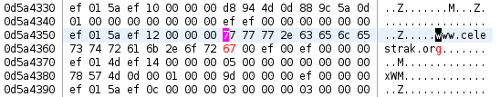

Title: Binary patching for fun and zero profit
Category: blog
Tags: sdr, satellites, linux, reverse engineer
Slug: binary-patching
Date: 2023-03-07

I use software-defined radio (SDR) to download [real-time data from weather satellites](https://ccoff.github.io/chasing-weather-satellites-with-sdr). To generate the imagery from the data I use the excellent, but no longer maintained, [wxtoimg](https://wxtoimgrestored.xyz) program on Linux. It generates nice map overlays for the imagery, but to do this correctly, wxtoimg needs up-to-date information on satellite positions. It gets this by downloading the current [orbital data](https://en.wikipedia.org/wiki/Two-line_element_set) from the internet. Unfortunately wxtoimg uses a hard-coded string for the target hostname, so when the domain changed a few months ago from celestrak.*com* to celestrak.*org*, wxtoimg couldn't get its satellite positions, and the map overlays were completely wrong.

wxtoimg is closed-source and abandoned by its developers, so getting a fix or recompiling weren't an option. I could have written a cron job to fetch the updated satellite data and move it to the configuration folder. But it seemed like it would be easy enough to just patch the program itself to use *celestrak.org* instead of *celestrak.com* and be done with it, with no need for external workarounds.

For the uninitiated, you can alter a program's behavior by making relatively small changes directly to its code (also known as "patching a binary"). Sometimes this is for malicious purposes, but in my case, I wanted to fix a bug that otherwise could not be fixed because the source code was not available.

## Try the easy things first

I hoped and assumed that "celestrak.com" was just a string in the **.data** or **.rodata** sections of the executable that I could modify with a hex editor. But an initial search with the *strings* utility didn't turn up anything. So I wrote a short program in C to look for various byte patterns. Again nothing. Next I tried [flare-floss](https://github.com/mandiant/flare-floss), which does deep searches of executables for obfuscated strings. Same result -- nothing.

The string had to be in there somewhere, but where?

I ran [strace](https://strace.io) to see what exactly wxtoimg was doing, and as expected there was an HTTP GET request to celestrak.com (104.168.149.178) to get the satellite data:

```text
connect(8, {sa_family=AF_INET, sin_port=htons(80), sin_addr=inet_addr("104.168.149.178")}, 16) = 0
send(8, "GET /NORAD/elements/weather.txt "..., 125, 0) = 125
send(8, "\r\n", 2, 0)                   = 2
recv(8, "HTTP/1.1 301 Moved Permanently\r\n"..., 4096, 0) = 408
close(8)                                = 0
```

A regular **send()** call was used to get the satellite data file. It was clear, however, that a simple hex edit replacing "com" with "org" wasn't in the cards. I was going to have to dig deeper and do some [static analysis](https://en.wikipedia.org/wiki/Static_program_analysis) on the wxtoimg executable.

## Static analysis

Static analysis involves examining the disassembled executable without running it. First I determined what I was dealing with:

```text
chris@host:~$ file /usr/local/bin/wxtoimg
/usr/local/bin/wxtoimg: ELF 32-bit LSB executable, Intel 80386, version 1 (SYSV), dynamically linked, interpreter /lib/ld-linux.so.2, for GNU/Linux 2.2.5, stripped
```

It was a 32-bit executable. I was happy about that, because at the assembly code level I've worked almost entirely in the 16- and 32-bit space --  64-bit not so much. (Several years ago, to put food on the table I worked on 16-bit DOS and 32-bit Linux embedded telecom products.)

To do static analysis you need a good disassembler, and in my case, one that also ran on Linux and handled [ELF executables](https://en.wikipedia.org/wiki/Executable_and_Linkable_Format). In the last few years a new player has arrived on the software reverse engineering scene courtesy of the NSA (yes, *that* NSA): [Ghidra](https://ghidra-sre.org). I had never used Ghidra before, but it looked promising with lots of useful features. And unlike other comparable programs costing hundreds of dollars, it was free.

I loaded up wxtoimg in Ghidra, which then took a few minutes to disassemble and analyze its code. The Code Browser gave me a list of disassembled functions, a memory map showing the program sections (**.text**, etc), and other useful goodies.

Having located the **send()** function, I worked up the call tree, hoping to find where the "celestrak.com" string came from. I made it up one or two levels, but then the trail stopped. When I looked for references to the next function, Ghidra couldn't find anything. This wasn't too surprising; the disassembler does the best it can to make sense of the raw binary code, but it's not perfect, and some things can only be determined at runtime.

I had gone as far as I could with static analysis for the moment, so it was time to do some [dynamic analysis](https://en.wikipedia.org/wiki/Dynamic_program_analysis) and run wxtoimg under a debugger.

## Unwinding the stack

A brief detour down memory lane: in my software development days I used a program from Microsoft called Codeview. It had a text console split into several windows that allowed you to view a program's memory and registers in real-time while stepping through instructions. It was invaluable for seeing how the stack and memory management worked at a low level.

What really gave me deeper knowledge of the stack, however, was the excellent article ["Smashing the stack for fun and profit"](https://www.eecs.umich.edu/courses/eecs588/static/stack_smashing.pdf) (which also inspired the title of this blog post). The intended audience was those looking to spawn shell code from within a vulnerable executable. Namely, by overwriting parts of the stack via buffer overflow exploits (AKA "smashing the stack"). But the same principles of stack layouts used in cracking applied equally to reverse engineering and non-malicious binary patching.

Fast forward to the present. In Ghidra I set a breakpoint on **send()**, started wxtoimg, and selected the option to update the satellite data. The debugger (Ghidra uses [gdb](https://www.sourceware.org/gdb) under the hood) stopped and now I had the call stack backtrace.

I hadn't examined a stack at byte level in several years and was rusty. Dredging up my stack-smashing knowledge from days of yore, I looked at the **EBP** register to get the base pointer. Then I went to that address in Ghidra's memory viewer to get to the entry point of the **send()** call. The [**send()** function](https://linux.die.net/man/2/send) has the following call signature:

```
ssize_t send(int sockfd, const void *buf, size_t len, int flags);
```

The second parameter (**buf*) contains the data to send, and this is what I was interested in. To get that parameter's value though, I had to go to the right place in memory. On the 32-bit x86 architecture, the calling convention places function parameters on the stack as follows:

```
Towards the top of the stack (lower memory addresses)
         .
       .:::.
     .:::::::.
       :::::
       :::::

Additional local variables, etc...
---------------------------------
Local variable      (EBP - 4)
---------------------------------
Base pointer        (EBP)
---------------------------------
Return address      (EBP + 4)
---------------------------------
Parameter 1         (EBP + 8)
---------------------------------
Parameter 2         (EBP + 12)
---------------------------------
Parameter 3         (EBP + 16)
---------------------------------
Additional parameters, etc...

       :::::
       :::::
     ..:::::..
      ':::::'
        ':'
Towards the bottom of the stack (higher memory addresses)
```


So by adding 12 bytes to **EBP**, I had the address to the second parameter **buf*. And that contained the HTTP GET request for the satellite data, confirming I was in the right place.

I moved up the call stack from **send()**, eventually landing in a bunch of [Tcl](https://en.wikipedia.org/wiki/Tcl) networking function calls. I was vaguely aware of Tcl but had never programmed in it. Wikipedia said Tcl was commonly "embedded into C applications, for rapid prototyping, scripted applications, GUIs, and testing." And that appeared to be the case here with wxtoimg -- it was an executable stuffed with embedded Tcl scripts and Tcl library code.

But that gave me an idea -- I downloaded the Tcl source code and found that some strings in wxtoimg were in Tcl functions. By searching for strings in wxtoimg that were also in the Tcl source, I could correlate sections of wxtoimg's disassembled code with Tcl library functions. This was a huge help in determining what some of these functions were doing.

I continued working through the call stack, but started getting lost in a maze of function calls trying to determine where "celestrak.com" came from. It seemed that the embedded Tcl script files were obfuscated in the executable at rest and loaded on the fly. As I continued to work through the function calls it occurred to me that:

 1. Even when I found the right Tcl script, I might not be able to reverse-engineer the obfuscation algorithm to patch it correctly.
 2. Even if I patched that particular script in the executable, what if another script somewhere else in the program used a hard-coded "celestrak.com" string? I'd have to repeat the process all over again.

For these reasons, I decided it was easier to intercept the "celestrak.com" hostname string later in the call stack, closer to where it was actually used to open a network connection. In other words, instead of patching an embedded, obfuscated Tcl script in the executable, I would patch the embedded Tcl network library code itself to use the correct hostname.

## Making the patch
Patching a binary is not a simple thing. Pitfalls are everywhere: one wrong bit or byte, a miscalculation in a jump, or any other number of slip-ups, and the program will at a minimum exhibit unexpected behavior, or more likely, segfault and crash.

At a macro level, all I wanted to do was look at the hostname string used to open a connection, and if it matched "celestrak.com" replace it with "celestrak.org". But there were some complications. I wanted my patch to be in complete control of the registers and minimize stack alterations. That meant avoiding function calls to library routines like **strcmp()** and **strcpy()**, and using instead a self-contained block of code that did the string manipulations with no "outside" interference.

I wrote up the patch code in C, compiled it, and then used [objdump](https://en.wikipedia.org/wiki/Objdump) to disassemble it. For example, here's the portion of the patch that copies the correct string to the hostname value (because of my DOS days, I "think" in Intel assembly syntax instead of AT&T syntax, so that's what appears below):

```
  32:	8d b3 d0 a5 c2 ff    	lea    esi,[ebx-0x3d5a30]
  38:	b9 12 00 00 00       	mov    ecx,0x12
  3d:	fc                   	cld
  3e:	f3 a4                	rep movs BYTE PTR es:[edi],BYTE PTR ds:[esi]
```

This gave me a starting point to work from for the assembly code and its associated opcodes that would ultimately become the patch. But there was still a lot of work to do, not the least of which was determining *where* to place the patch in the executable. My patch (i.e., the sequence of raw opcodes) worked out to 81 bytes in total. I needed to find that much unused space -- also known as a [code cave](https://en.wikipedia.org/wiki/Code_cave) -- in the executable.

I used the [gocave](https://github.com/guitmz/gocave) program, which just looks for sequences of repeating null bytes in an executable. The largest cave it found in the **.text** section was 7 bytes -- nowhere near large enough to hold my patch code. The **.data** and **.rodata** sections, on the other hand, had large caves, but the sections weren't marked as executable. I didn't really want to mess with the executable's section headers, whether by changing read/write/execute permissions, expanding an existing section, or creating an entirely new one. It seemed I was out of luck...

But as mentioned above, I was able to correlate some code sections with Tcl library functions. One of those functions was [**Tcl_SocketObjCmd()**](https://core.tcl-lang.org/tcl/file?name=generic/tclIOCmd.c), which opened a client socket to the specified hostname. But the function also contained several code blocks for server sockets, for example:

```
 if (server) {
	AcceptCallback *acceptCallbackPtr = (AcceptCallback *)Tcl_Alloc(sizeof(AcceptCallback));

	Tcl_IncrRefCount(script);
	acceptCallbackPtr->script = script;
	acceptCallbackPtr->interp = interp;

	chan = Tcl_OpenTcpServerEx(interp, port, host, flags, backlog,
		AcceptCallbackProc, acceptCallbackPtr);

    /* Server-specific code continues for several more lines... */
  } else {
    /* Client code here -- MUST NOT TOUCH! */
  }
```

wxtoimg was just a TCP client though, so those blocks of server code were unused and taking up space -- space I could put to good use. That particular server code block above occupied 201 bytes, which was more than enough room for my 81-byte patch. And crucially, one of the parameters for the **Tcl_SocketObjCmd()** function was the target hostname ("celestrak.com").

So I had my binary patch code, and somewhere to put it. Still, I couldn't just drop the bytecode into the executable; doing so would surely cause it to blow up in spectacular fashion. Instead I had to do some careful hand-tweaking of the code so it played nicely with the rest of the executable. For example:

 * Jump offset values: These had to be manually calculated to ensure jumps went to the right locations.
 * Stack/register maintenance: Any registers or flags that the patch code changed had to be saved in advance and later restored. This ensured that the existing code had no idea my patch was ever there.

If this sounds like a laborious process, you're right. There's a reason we use compilers to do this dirty work for us whenever possible.

I made the necessary adjustments, copied the bytecode into the executable, and was finally ready to run the patched wxtoimg. Did it work? Of course not. Code hardly ever works perfectly the first time through, speaking for myself at least. Especially when working with raw bytecode. When I went to the option in wxtoimg to update the satellite data, the GUI just hung.

When I added my patch code to the binary, I had overwritten all of the remaining unused server code with [NOPs](https://en.wikipedia.org/wiki/NOP_(code)). But Ghidra indicated that some of what was seemingly unused server code was in fact referenced by binary code branches elsewhere. I had effectively left "hanging" branches that went to nowhere. I didn't know for sure, but I was guessing that even though the program was not actually executing those hanging branches, the CPU was still following them due to [predictive execution](https://en.wikipedia.org/wiki/Branch_predictor). Because I had invalidated some of those paths with NOPs, the program hung.

I may be totally wrong about this; I'm not an expert in CPU design. What I do know is that I scaled back my NOP padding, retaining the server code that was referenced by another branch (luckily there was still plenty of space for my patch). And this time -- it worked! My patch stepped in anytime a socket to celestrak.com was requested, and opened it at celestrak.org instead:

<figure>
<a href="images/binary-patching-memory-string-patch-success.png"></a>
<figcaption>A view of memory, just after the patch makes the final alteration to the hostname string.</figcaption>
</figure>

Further testing confirmed that my binary patch was working as intended, with no apparent adverse effects.

In the end, it was a lot of work to change those three letters in the hostname from "com" to "org". But it's not the destination, it's the journey right? And now every time I run my patched wxtoimg and watch it update the satellite data, I have to admit I get a small buzz.
