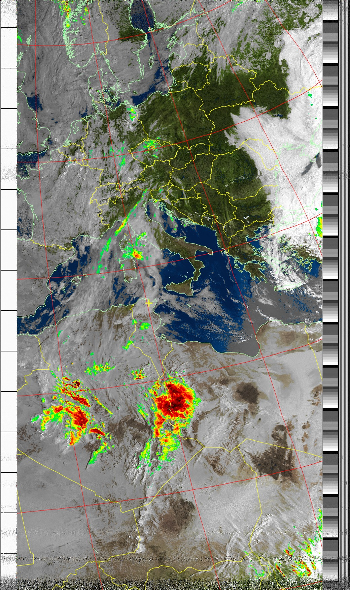
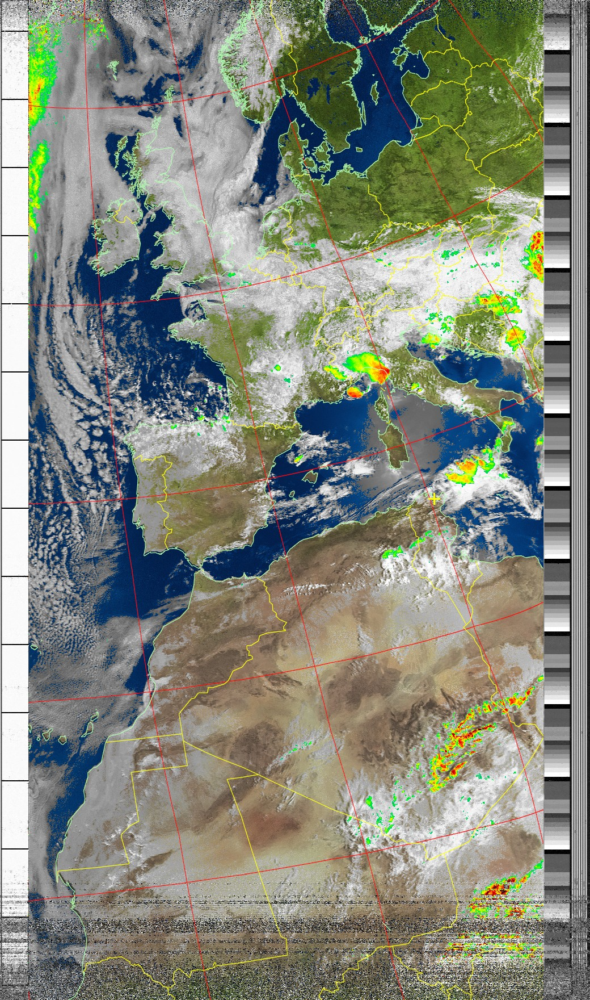
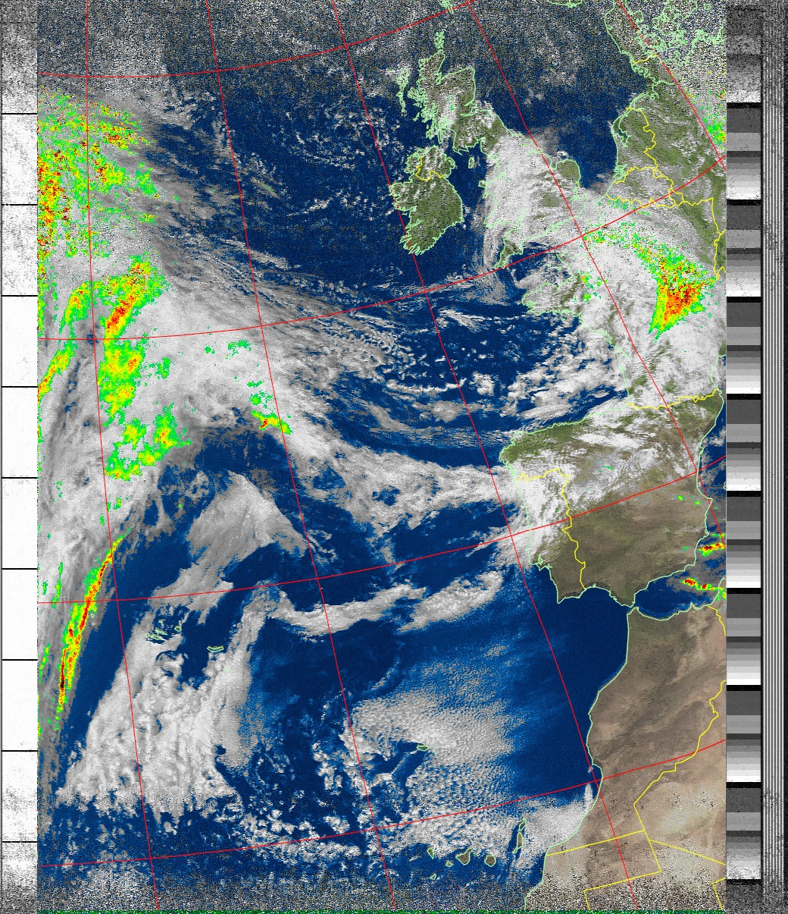
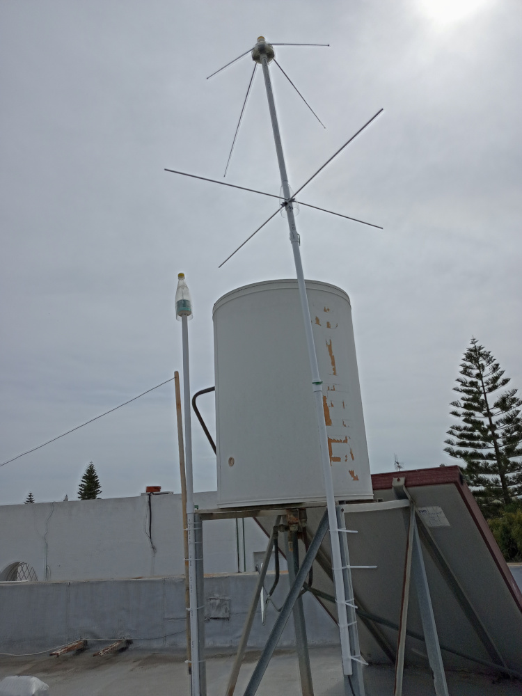
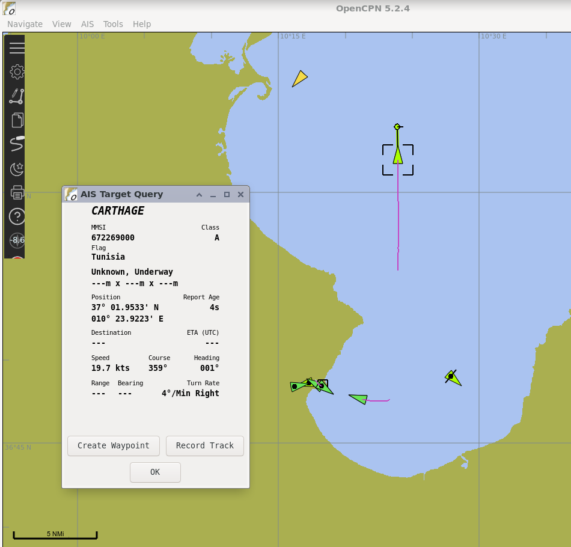

Title: Chasing weather satellites: the sequel
Category: blog
Tags: radio, sdr, satellites
Slug: chasing-weather-satellites-sequel
Date: 2023-05-14

This is a follow-up to my previous post about using [software-defined radio (SDR) to download real-time data from weather satellites](https://ccoff.github.io/chasing-weather-satellites-with-sdr). I wrapped up that post with "there are several other types of satellite antennas worth exploring -- the double-cross and Moxon turnstile antennas look like they may be an improvement on the basic turnstile."

Since writing that, I built a prototype Moxon turnstile that performed about as well as the basic turnstile I constructed. I was considering building a quadrifilar helix (QFH) antenna, which is regarded by many as the gold standard for weather satellite reception (and has a great name). But then I came across the [asymmetric turnstile antenna (ATA)](https://www.reddit.com/r/RTLSDR/comments/v07fn9/ive_been_experimenting_with_an_asymmetric/), a type I had not heard of before.

The ATA is a kind of hybrid between a QFH and traditional turnstile. Like a QFH, it has asymmetric lengths for its elements, and is shorted (i.e., the cable's shield is connected to its center conductor). Like a turnstile, the ATA has four straight elements radiating outward and a reflector. It seems to offer the best of both worlds -- the performance of a QFH with simplified construction. (Even easier construction than a traditional turnstile in fact -- there's no phasing harness to worry about with the ATA design).

According to [sgcderek's guide](https://sgcderek.github.io/tools/ATA.html), the ATA is more commonly used at higher frequencies, and relatively unexplored down in VHF where the NOAA satellites transmit APT. Which helps explain why I hadn't heard of it before. In any event, I built a prototype antenna, got it up on the roof, and the results were, in a word, excellent. I started getting usable signal at around 3° elevation, which meant I could capture almost an entire pass, save for 15-30 seconds on either end. Gain was also very good, with SNR levels reaching as high as 55 dB. (In my experience, an SNR of 20 to 25 dB produces usable, but noisy imagery. Anything above 30 dB produces reliably clean, noise-free imagery.)

I'm in an urban setting with some obstructions on the horizon and a noisy RF environment. But for the high, medium, and low passes shown below, I only used a basic setup (no filters or LNA). The results were impressive:

<figure>
<a href="images/wxsat-2-2023-03-19-08-54-noaa-19-maxel-74.4E.jpg"></a>
<figcaption>High pass (74.4° max elevation): NOAA-19, March 19, 2023 at 07:54 UTC.</figcaption>
</figure>

<figure>
<a href="images/wxsat-2-2023-05-12-09-49-noaa-19-maxel-39.6W.jpg"></a>
<figcaption>Medium pass (39.6° max elevation): NOAA-19, May 12, 2023 at 08:49 UTC.</figcaption>
</figure>

<figure>
<a href="images/wxsat-2-2023-04-14-12-56-noaa-18-maxel-8.7W.jpg"></a>
<figcaption>Low pass (8.7° max elevation): NOAA-18, April 14, 2023 at 11:56 UTC.</figcaption>
</figure>

Over eight minutes of imagery from an 8.7° maximum elevation pass is pretty darn good, and would be unthinkable with my V-dipole or traditional turnstile antenna. Those antennas typically only started capturing usable data at around 20° elevation, or even higher.

Here is the antenna up on the roof (with my ADS-B and HF antennas visible as well):

<figure>
<a href="images/wxsat-2-antenna.jpg"></a>
</figure>

## But wait, there's more

The antenna works well for more than just NOAA sats. The [ISS](https://en.wikipedia.org/wiki/International_Space_Station) has a packet repeater that transmits [APRS](https://en.wikipedia.org/wiki/Automatic_Packet_Reporting_System) data at around 145 MHz, and the antenna picked it up with ease:

```text
APRS: IK3ZGB-2>CQ,RS0ISS*:=4542.75N/01142.00E`73' Via ISS de Cris {UISS54}
APRS: 9H1FF>APRS,RS0ISS*::IW6PUA   :msg rcvd tnx
APRS: RS0ISS>0P0PS4,APRSAT:'v&l SI]ARISS-International Space Station=
APRS: OE1WTR>CQ,RS0ISS*,WIDE2-2,QAR::I3JUK    :73' Via Satellite
APRS: 9H1FF>APRS,RS0ISS*:=/<@16R-]&/  B
APRS: IW6PUA>CQ,RS0ISS*::9H1FF    :HELLO, QSL and 73 via ISS
APRS: IW6PUA>CQ,RS0ISS*:=4152.25N/01404.00E-Matteo via ISS
APRS: ON4BN>ALL,RS0ISS*,NA1SS,PSAT:=5103.45N/00522.30Er73' Via Satellite de ON4BN
APRS: 9H1FF>APRS,RS0ISS*:Greetings to all from Malta
APRS: 4Z4DP>SQTQ90,RS0ISS*:'?_Dl `/]73 from Jerusalem=
```

The antenna also does well with [AIS](https://en.wikipedia.org/wiki/Automatic_identification_system) transmissions from maritime traffic, which are broadcast at around 162 MHz:

<figure>
<a href="images/wxsat-2-ais-opencpn.png"></a>
<figcaption>AIS data plotted on a map with the <a href="https://opencpn.org/">OpenCPN</a> program.</figcaption>
</figure>

All things considered, I'm quite impressed with the ATA's performance, and it will be my "go-to" antenna for NOAA APT reception from now on. It appears to provide comparable performance levels to a QFH, and is easier to build.

That said, I'm never satisfied. There are some obstructions on the horizon that block the signal; there's not much I can do about that. However, I also see telltale wavy lines in some of the images that are indicators of RF interference, perhaps from power lines. There are [combined LNA/filters](https://www.nooelec.com/store/sawbird-plus-noaa-308.html) for NOAA sats to help improve reception, but I don't need more gain from an LNA -- this antenna provides plenty of gain. But I would like to see if a 137 MHz bandpass filter cuts down on the RF interference at all. Somewhat surprisingly I haven't found any standalone bandpass filters for that frequency, so I may just try to build one myself.

