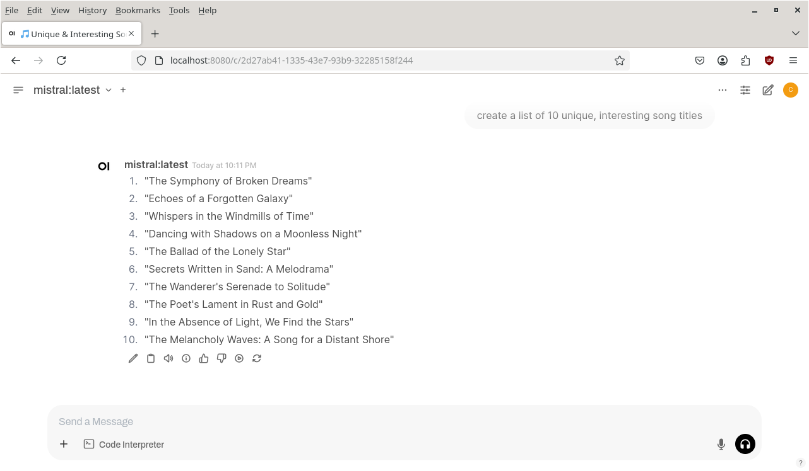

Title: Running a local LLM
Category: blog
Tags: ai, llm, linux, python
Slug: running-local-ai-llm
Date: 2025-03-18

I've recently been using a local setup for testing and evaluating various [LLMs](https://en.wikipedia.org/wiki/Large_language_model). This affords me some privacy, without the need to create accounts or send information into the ether. Tools such as [Ollama](https://ollama.com/) and [Open WebUI](https://www.openwebui.com/) make setting this up a straightforward process.

This article is a quick overview of how to install and run an LLM locally. (It also serves as notes to myself when I need a refresher.) The following procedures are for Linux because that's what I run. The general steps for Windows and MacOS are probably similar; consult the relevant documentation for [Ollama](https://github.com/ollama/ollama/tree/main/docs) and [Open WebUI](https://docs.openwebui.com/).


# LLM installation with Ollama

[Ollama](https://ollama.com/) makes it very easy to download an LLM and have it up and running in minutes. This command installs and starts the Ollama service:

```
curl -fsSL https://ollama.com/install.sh | sh
```

Then to download and run a model, all you need to do is:

```
ollama run mistral
```

I chose [Mistral's model](https://mistral.ai/) here, but you can choose from [several other models](https://ollama.com/search). It's worth trying several of them out (Microsoft's [phi4](https://ollama.com/library/phi4), [DeepSeek](https://www.deepseek.com/), etc.) to see how they perform. Just replace *mistral* with the name of the model you want to run.

The ```>>>``` prompt indicates the LLM is ready and waiting:

```text
>>> which is faster, a computer or a sprinter?
A sprinter is much faster than a computer. While a computer processes 
information very quickly, this speed is not comparable to the physical 
speed of a human sprinter. For example, Usain Bolt, one of the fastest 
humans ever, can run at speeds up to 27.8 mph (44.7 km/h), while even the 
fastest electronic data processing occurs on the order of nanoseconds or 
billionths of a second. However, in different contexts, a computer may be 
much faster than a human for certain tasks such as calculating 
mathematical problems at incredible speeds.
```

## Ollama API

You're not limited to interacting with the LLM by manually typing in prompts. Ollama provides API access on localhost port 11434 so you can programmatically engage with the LLM. For example, you can do a quick and dirty *curl* request:

```
curl -X POST http://localhost:11434/api/generate -d '{"model": "phi4", "prompt": "what would you call a cross between a blueberry and a peach?"}'
```

For greater control there's always Python. For example:

```
import requests
import json

url = "http://localhost:11434/api/generate"

data = {
    "model": "phi4",
    "prompt": "write a humorous limerick about a walrus",
    "stream": False
}

headers = {
    "Content-type": "application/json"
}

response = requests.post(url, headers=headers, data=json.dumps(data))
if response.status_code == requests.codes.ok:
    print(response.text)
```

# Web interface installation with Open WebUI

For a more polished experience, you can use [Open WebUI](https://www.openwebui.com/). This provides a user-friendly web interface with no need for command-line interaction. Perfect for enabling non-technical people around you to also use your local LLMs.

There are several ways to get Open WebUI up and running, including Docker and Kubernetes. The following procedure opts for a lighter footprint.

First, install ```nvm``` (Node version manager) to get a more recent Node.js version (as of writing, Open WebUI requires version 20.10 or newer):

```
wget -qO- https://raw.githubusercontent.com/nvm-sh/nvm/v0.40.1/install.sh | bash
source ~/.bashrc
nvm list-remote
nvm install v20.19.0
nvm list
```

The ```nvm list``` command lists all of the Node.js versions available on the host. If you need to switch between versions, type the following command, replacing `[version]` with the version you want to run:

```
nvm use [version]
```

Alternatively, to use the installed system version:

```
nvm use system
```

Next, download and configure Open WebUI:

```
cd ~
git clone https://github.com/open-webui/open-webui.git
cd open-webui/
cp -RPp .env.example .env
```

Then install the front end:

```
npm install
npm run build
```

Next, set up the Python virtual environment:

```
cd ~
python3 -m venv webui-env
source webui-env/bin/activate
cd ~/open-webui/backend
pip install -r requirements.txt -U
```

(If the `pip install -r requirements.txt -U` command fails, review the error messages for missing packages and install them. For example, I had to install the `postgresql-common` and `libpq-dev` packages.)

Finally, start Open WebUI:

```
bash start.sh
```

After yet more file downloads and installations, Open WebUI should be up and running. Open a web browser and go to [http://localhost:8080/](http://localhost:8080/). Follow the steps to set up an admin account, and then you should see a page with the LLM awaiting your prompt:

<figure>
<a href="images/ai-llm-mistral-initial-page.png"></a>
<figcaption>Initial page of Open WebUI with the Mistral LLM awaiting a prompt. Click the image for the full-resolution picture.</figcaption>
</figure>

You can then enter a prompt, provide feedback on the LLM's response, view statistics, and more:

<figure>
<a href="images/ai-llm-mistral-response.png"></a>
<figcaption>Mistral's response to a prompt asking it to generate song titles. Click the image for the full-resolution picture.</figcaption>
</figure>

Happy LLM-ing!
