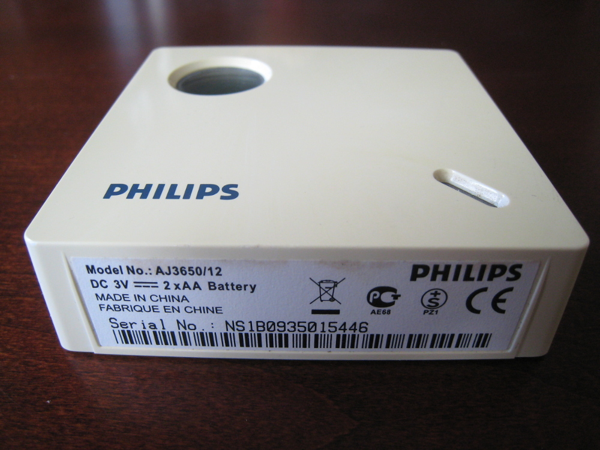

Title: Decoding temperature sensor data using software-defined radio
Category: blog
Tags: radio, sdr, sensors
Slug: temperature-sensor-sdr-radio
Date: 2017-12-16

I have an old Philips clock radio that includes a standalone temperature sensor module:



The idea is that you place this sensor outdoors, where it periodically sends temperature updates to the clock radio inside. I wanted to capture those transmissions and use the data programmatically, instead of just seeing it displayed on the clock radio. It occurred to me that a radio receiver ought to be able to pick up these transmissions.

I have several software-defined radio (SDR) USB dongles (such as [this](https://www.rtl-sdr.com/buy-rtl-sdr-dvb-t-dongles/) and [this](https://www.aliexpress.com/item/Mini-Portable-Digital-USB-2-0-TV-Stick-DVB-T-DAB-FM-RTL2832U-R820T2-Support-SDR/32914826153.html)). It's pretty amazing what you can do with these low-cost devices, which generally have a range of around 25 MHz to 1.75 GHz. Beyond the obvious radio and TV broadcasts, I've picked up aircraft ([ACARS](https://en.wikipedia.org/wiki/ACARS)) transmissions, weather data, pager and GSM traffic, and more. So I thought SDR might be a good way to see what this temperature sensor was sending to the clock radio.

I had no idea what frequency the temperature sensor used, but the [ISM band](https://en.wikipedia.org/wiki/ISM_band) seemed like a good place to start investigating, as many consumer-grade devices transmit around 433 MHz. The excellent and popular [rtl_433 project](https://github.com/merbanan/rtl_433) supports a large number of 433 MHz devices, enabling you to decode protocols and output data in a number of formats (JSON, CSV, etc.).

I plugged in an SDR dongle, started up rtl_433 and waited for the temperature sensor to send one of its updates. Sure enough, rtl_433 picked it up straight away and dumped the raw data:

```text
[00] {40} 00 14 b9 c0 18 : 00000000 00010100 10111001 11000000 00011000 
[01] {36} 01 4b 9c 01 80 : 00000001 01001011 10011100 00000001 1000
[02] {36} 01 4b 9c 01 80 : 00000001 01001011 10011100 00000001 1000
```

The data packet was 36 bits long and repeated three times (with an extra starting nibble -- probably a sync signal of some sort -- on the first data row). rtl_433 couldn't decode anything from the data, which wasn't too surprising -- there are many, many types of sensors out there, each with their own proprietary format. If I wanted to make use of my sensor, I would have to reverse-engineer the protocol and write a decoder myself.

## Reverse-engineering the protocol

First I had to determine the signal's timings. I loaded up a captured signal in Audacity:


This showed a good, strong signal, with the long and short pulses clearly visible; the temperature sensor was using [pulse-width modulation (PWM)](https://en.wikipedia.org/wiki/Pulse-width_modulation). With Audacity's selection tools, I could precisely determine the timings for the pulse and gap widths.

With that done, I could work on the protocol data itself. I knew the temperature sensor reported at least the following information:

* Channel
* Temperature (in Celsius)
* Battery status

By manually changing the sensor's channel, placing it in the freezer, using an old battery, etc. I could see where and how the data packets changed. From there it was a relatively straightforward process to map out the protocol.

One final piece remained -- the last nibble in the packet changed based on the preceding data. I assumed it was a checksum or CRC of some sort. Basic checksum tests turned up nothing, so I turned to the excellent [RevEng](http://reveng.sourceforge.net), which can calculate a huge number of CRCs for a given bit pattern. RevEng made short work of the data and determined it was using CRC-4 with a polynomial 0x9 and initial value of 0x1.

## Putting it all together

Having decoded the temperature sensor's protocol, it was easy enough to write up a decoder for it in rtl_433. A Github PR later, and rtl_433 now includes support for my Philips temperature sensor (see [here](https://github.com/merbanan/rtl_433/blob/master/src/devices/philips.c) for the code).

Now I can pick off data from the temperature sensor and output it in a variety of formats for further processing. Here's some sample output, with sensor data in JSON on the last line:

```text
walrus@box:~$ rtl_433 -F json
rtl_433 version 18.12-89-gdd842fc8af branch master at 201902131202 inputs file rtl_tcp RTL-SDR
Registered 96 out of 120 device decoding protocols [ 1-4 8 11-12 15-17 19-21 23 25-26 29-36 38-60 62-64 67-71 73-100 102-103 108-116 119 ]
Detached kernel driver
Found Rafael Micro R820T tuner
Exact sample rate is: 250000.000414 Hz
[R82XX] PLL not locked!
Sample rate set to 250000 S/s.
Tuner gain set to Auto.
Tuned to 433.920MHz.
{"time" : "2017-12-16 14:25:38", "model" : "Philips outdoor temperature sensor", "channel" : 3, "temperature_C" : 22.800, "battery" : "OK"}

```

